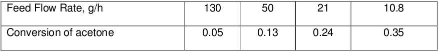

The following data are obtained in an ideal tubular flow reactor for the gaseous pyrolysis of acetone at 520&deg;C and 1 atm. The reaction is

CH3.CO.CH3 → CH2.CO + CH4

The feed consists of pure acetone, and the reactor is a 3.3 cm i.d. pipe of 80 cm length.
Consider that the reaction mixture obeys ideal gas law and reaction follows second-order
kinetics. Find the reaction velocity constant.

