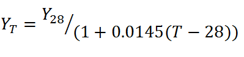
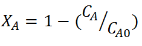
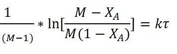
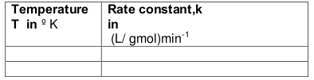

#### Procedure :
<ol style="list-style-type: number; text-align: justify;">
<li>Note down the concentration of ethyl acetate(EA) and NaOH in stock solution.</li>
<li>Fill the reservoirs with NaOH and ethyl acetate stock solution.</li>
<li>Calculate the volume of the tubular reactor.</li>
<li>Switch on the pump and allow ethyl acetate to flow into the reactor at
	certain flowrate and measure the flowrate(vA) using rotameter.</li>
<li>Set the required temperature to be maintained in the reactor. Switch on the
	heater to heat the reactor contents to the required temperature.</li>
<li>Calculate the flowrate of NaOH (
 VB ) required to keep the desired value of M( M = CBO/CAO ). M may be greater than or equal to one. Calculate the total flowrate (Q).</li>
<li>Adjust the flowrate of NaOH to the calculated value, without changing
	the EA flowrate.</li>
<li> Calculate the actual value of M obtained after adjusting the flowrates.</li>
<li>Calculate the space time using the total flow rate.</li>
<li>Start the stirrer in the reactor. Close the drain valve completely. Allow
	the reaction to proceed till steady state is attained, as indicated by
	constant reading in the conductivity meter.</li>
<li>Note down the conductivity (in mS/cm) of the reaction mixture in, after
	steady state is attained. Note: Some conductivity meters may display
	conductance (mS) not the conductivity(mS/cm) [Refer theory for more
	information].</li>
<li>Determine the concentration of unreacted NaOH in the reaction
	mixture by using the conductivity meter calibration equation.</li>
<li>Repeat steps (6) to (12) for different EA flowrates .</li>
<li>Conduct the experiment at different temperatures.</li>
</ol>

#### Observations and calculations:</h3> 
A -> Ethyl acetate 
B -> NaOH 
Strength of Ethyl acetate in stock solution = CAS = ------------------------ gmol/L  
Strength of NaOH in stock solution = CBS = ------------------------ gmol/L  
Diameter of the tube ,d = -----------------------cm 
Coil diameter , Dc = &nbsp;&nbsp;&nbsp;&nbsp;&nbsp;&nbsp;
cm 
Number of turns= Nt = 
V = volume of tubular reactor = ( d2/4)×
Dc Nt =
= -----------------------cm3 
V =----------------------- L 

Tabular columns: 

 

##### Calculations :
Calculate the total flow rate Q = VA + VB =  LPM  
Calculate the space time , = V/Q = &nbsp;&nbsp; &nbsp;&nbsp;    min 

Set value of M =
  
	Concentration of ethyl acetate in the feed mixture, 
	
  
	CAo = --------------------gmol/L
 
	Concentration of NaOH in the feed mixture, 
	
  
	CBo = --------------------gmol/L
 
	As the conductivity meter calibration is available only at 28&deg;C, the conductivity 
	meter reading obtained at a given temperature of reaction is to be corrected for 28&deg;C. 
	Temperature compensation for conductivity meter 
	

  
	Where , 
	YT =conductivity meter reading at any temperature T in mS/cm 
	Y28 = conductivity meter reading at a temperature of 28&deg;C in mS/cm 
	Obtain Y28 corresponding to measured conductivity meter reading ( YT) using the
	equation above. 
	Conductivity meter is calibrated for concentrations of NaOH in the reaction mixture at a
	temperature of 28&deg;C. 
	Obtain the Concentration of NaOH at 28&deg;C using the calibration equation given below
	Conductivity meter calibration equation for 28&deg;C. 

  
	Where,  
	CB= Concentration of NaOH in the reaction mixture at steady state  
	Y28 = Conductivity meter reading for solution, corrected for 28&deg;C 
	Concentration of unreacted NaOH in the reaction mixture at steady state, 
	CB=
	gmol/L (obtained from the conductivity meter calibration
	graph) 
	Concentration of ethyl acetate in the reaction mixture at steady state,  
	
  
	CA= --------------------gmol/L
 
	Conversion of ethyl acetate, = 

(CA/ CAo)=
Performance equation for PFR with rate equation of the form   
for M>1 , can be written as 

  

Plotting
 Vs 
yields a straight line passing through 
origin if the assumed rate equation is correct. The slope=k. 
For M=1, the performance equation is  
So the plot of 
vs  
yields a straight line passing through origin. The slope=k.  

  
Graph for M >1

 From the graph we get, 

Slope = k =..............
L/(g mole. min) 
Similarly the experiment may be performed with different temperatures and the 
rate constants at these temperatures may be determined. 
<b>Obtain the rate constant at three or more different temperatures.</b> 

 

##### From Arrhenius Equation,
 

 
Plot lnk vs 1/T 
Determine the activation energy (E) and the frequency factor (ko) from the slope and
intercept of the above plot. 
Intercept= lnk0 
Slope=-E/R 
R is the gas constant 
Frequency factor , ko=min-1(litre / gmol) 
Activation energy= E=

J/mol

##### Results :
The rate constant for the saponification of Ethy acetate with NaOH at a temp of
ToC, 
k = -------------------------------litre/((mol)(min)) 
Discuss and conclude on the temperature dependency of rate constant. 
The activation energy (E) for the reaction=J/mol 
The frequency factor (ko)=

min-1(litre / gmol)
