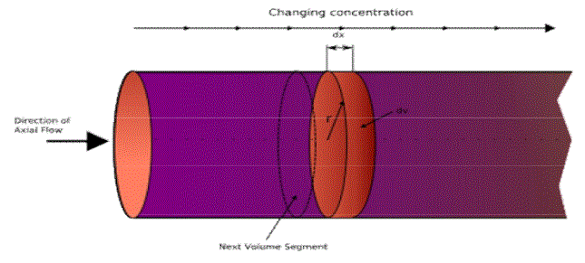

### Background and Theory

Tubular reactors are one category of flow reactors. These reactor have continuous inflow
and outflow of materials. In the tubular reactor, the feed enters at one end of a cylindrical tube
and the product stream leaves at the other end. The long tube and the lack of provision for
stirring prevents complete mixing of the fluid in the tube. Hence the properties of the flowing
stream will vary from one point to another, namely in both radial and axial directions.

  

Ideal tubular reactor is referred as a plug flow reactor(PFR). PFRs are frequently referred
to as piston flow reactors. The key assumption is that as a plug flows through a tubular reactor ,
the fluid is perfectly mixed in the radial direction but not in the axial direction (forwards or
backwards). Each plug of differential volume is considered as a separate entity, effectively an
infinitesimally small batch reactor, limiting to zero volume. As it flows down the tubular PFR,
the residence time () of the plug is a function of its position in the reactor. In the ideal PFR, the
residence time distribution is therefore a Dirac delta function(small and tall) with a value equal
to τ. The PFR model works well for many fluids: liquids, gases, and slurries. An ideal plug flow
reactor has a fixed residence time: Any fluid (plug) that enters the reactor at time t will exit the
reactor at time t + , where τ is the residence time of the reactor.

Residence time in the reactor is equal to the space time if the conditions in the reactor like
pressure and temperature are same as those at the entrance. In the ideal tubular reactor, which is
called the &ldquo;plug flow&rdquo; reactor, specific assumptions are made about the extent of mixing:

<ol style="list-style-type: number;">
<li>no mixing in the axial direction, i.e., the direction of flow</li>
<li>complete mixing in the radial direction</li>
<li>a uniform velocity profile across the radius</li>
</ol>

The absence of longitudinal mixing is the special characteristics of this type of reactor. It is an
assumption at the opposite extreme from the complete mixing assumption of the ideal stirred
tank reactor. The validity of the assumptions will depend on the geometry of the reactor and the
flow conditions. Deviations, which are frequent but not always important, are of two kinds:

1. mixing in longitudinal direction due to vortices and turbulence 
2. incomplete mixing in radial direction in laminar flow conditions 

#### Mass Balance :
Steady state molar balance over small elemental volume ΔV yields 

  

The conversion, XA, is defined as: 

XA = (inlet concentration - outlet concentration) / (inlet concentration) 
Volume of a PFR with given influent flow rate and feed composition to achieve a
required conversion may be obtained from the above equation, if the rate equation is known. The
3rd term in the above equation may be integrated if the rate equation is known.
Rate equation for a given reaction can also be obtained using a PFR.
For a single reaction say, A+B->C+D

Assume the rate equation to be and a constant density system

Experiments to be performed with different space times in the reactor with the known ratio of
reactant B to A(M) in the inlet. Steady state concentration of A at the reactor outlet may be
analysed for each run.

Now equation A after integration with for M>1 , can be written as 

 

Plotting

 vs 
  
yields a straightline passing through origin if the
assumed equation is correct. The slope=k. 
For M=1, the performance equation is 
So the plot of
vs 
  

yields a straightline passing through origin if the assumed equation is correct. The slope=k. 
If the data do not fit by a straight line assume different rate equation and proceed as above. 
<b>Note: For theory on conductivity meter, refer the &rdquo;Theory Section&ldquo; for Batch
reactor</b>

